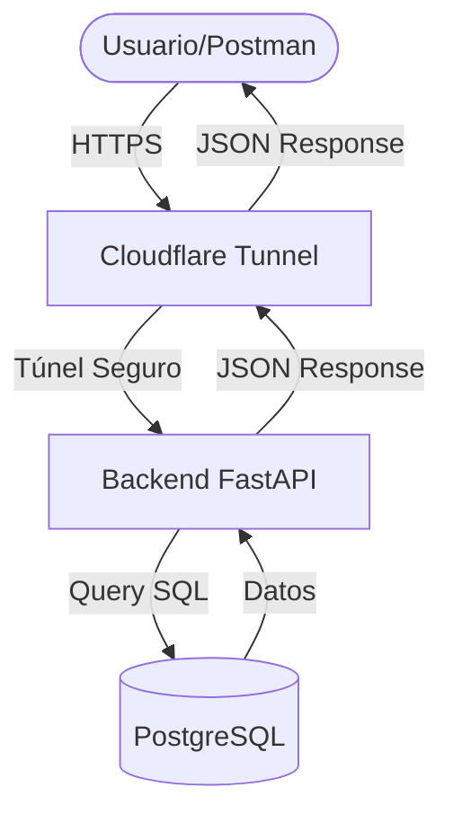

# Guía de Interacción y Arquitectura SAS Porter

Este documento explica cómo interactúan los sistemas, qué preguntas se pueden hacer y cómo responden las APIs.

## 🏗️ Arquitectura del Sistema

El flujo de información sigue este camino seguro:



---

## 🚀 Uso de la API del Chatbot

**Endpoint:** `POST https://adequate-notifications-diagnosis-tremendous.trycloudflare.com/chatbot/search`

### Estructura de la Petición (JSON)
```json
{
  "table": "nombre_de_la_tabla",
  "message": "término_de_búsqueda",
  "limit": 5
}
```

---

## 📋 Ejemplos de Preguntas y Respuestas

A continuación, se muestran ejemplos reales basados en tu base de datos actual:

### 1. Consultar Productos de Ahorro
*   **Caso de uso:** El usuario quiere saber sobre ahorros para niños.
*   **Petición API:**
    ```json
    {
      "table": "tabla_ahorro",
      "message": "menores",
      "limit": 1
    }
    ```
*   **Lo que responde la API:** Datos sobre "Ahorro Menores", incluyendo monto de apertura, requisitos y beneficios.

### 2. Consultar Requisitos de Trámites
*   **Caso de uso:** El usuario pregunta por los documentos para identificarse.
*   **Petición API:**
    ```json
    {
      "table": "tabla_requisitos",
      "message": "identificación",
      "limit": 1
    }
    ```
*   **Lo que responde la API:** Lista de documentos válidos (INE, Pasaporte, etc.) e instrucciones para el usuario.

### 3. Consultar Horarios de Sucursales
*   **Caso de uso:** El usuario pregunta por el horario de una zona específica.
*   **Petición API:**
    ```json
    {
      "table": "tabla_horarios",
      "message": "Sinaloa",
      "limit": 1
    }
    ```
*   **Lo que responde la API:** Días de semana, hora de apertura/cierre y zona horaria específica.

### 4. Consultar Cajeros (ATM)
*   **Caso de uso:** El usuario busca un cajero en una ciudad.
*   **Petición API:**
    ```json
    {
      "table": "tabla_atm",
      "message": "Zapopan",
      "limit": 1
    }
    ```
*   **Lo que responde la API:** Dirección exacta, geolocalización, colonia y si opera las 24 horas.

---

## 🔗 Conexión entre Componentes

1.  **Tablas de Datos**: Cada tabla es independiente. El Chatbot "decide" (o tú le indicas) en qué tabla buscar según el tema de la pregunta.
2.  **Búsqueda Inteligente**: La API busca en **todas las columnas de texto** de la tabla elegida. Por eso, si buscas "Matriz" en la tabla de horarios, te traerá el horario de Matriz, pero si buscas "Matriz" en la tabla de cajeros, te traerá la ubicación del cajero Matriz.
3.  **Seguridad**: Todas las peticiones pasan por el túnel de Cloudflare, lo que significa que el Chatbot puede estar en cualquier lugar del mundo y se conectará de forma segura a tu servidor local.

---

> [!TIP]
> **¿Cómo saber qué tablas existen?**  
> Envía un `GET` a `/chatbot/tables` para recibir la lista actualizada de todas las tablas que puedes consultar en tiempo real.
